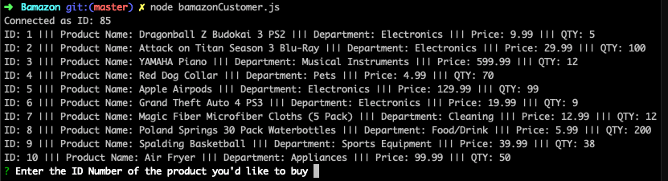
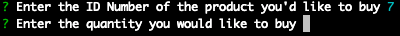
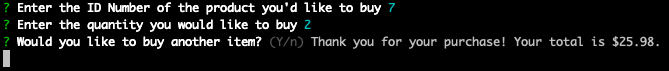
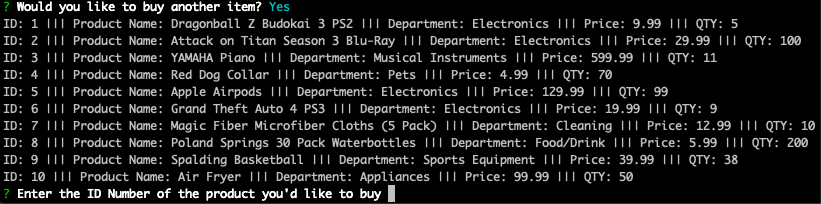
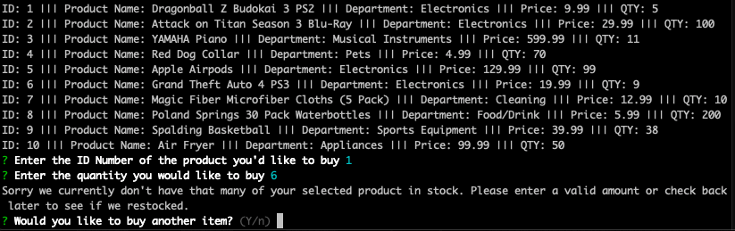

# MyTerminalStore

## Description
MyTerminalStore is an online store application created with MySQL and Javascript. The application will take in orders from customers and deplete stock from the store's inventory. Clone the Repository and run it in the terminal to get started.   

## Starting Up

 To start up enter the command "node bamazonCustomer.js". It will first display all of the items available for sale. There will be a prompt at the bottom asking the user to enter the ID number of the product they would like to buy. (Press ctrl + c at anytime to exit the application)  

After entering a value the application will ask the user to enter the quantity of the item previously chosen by ID number they would like to buy.  

 

If MyTerminalStore has the product left in stock your total will be displayed and the user will be asked if they would like to buy another item or exit the application fot now.
 

In the case the user wants to buy another item the updated list of products will appear and the user will again be asked the series of questions.

If MyTerminalStore does not have enough of the product in stock the user will be alerted and asked whether they would like to take another look at the inventory and purchase another quantity or item, or exit the application. 

## Technologies used:

* Javascript
* Node.js
* MySQL
* Inquirer Node Module 
* Terminal/Gitbash

## Upcoming Updates Soon!

* Currently adding Manager View. This mode will allow the manager to view all the products for sale, view low inventory, add to inventory and add new products. 
